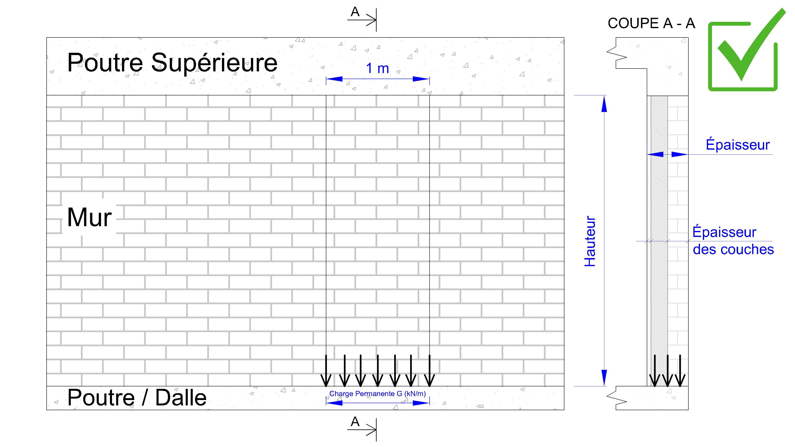
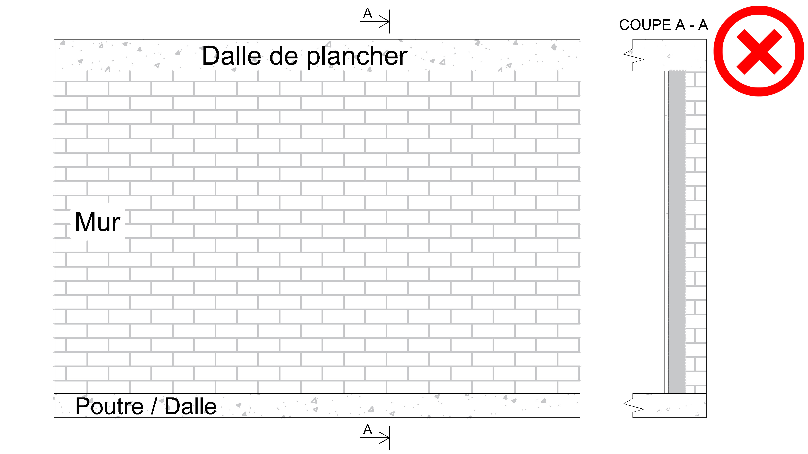
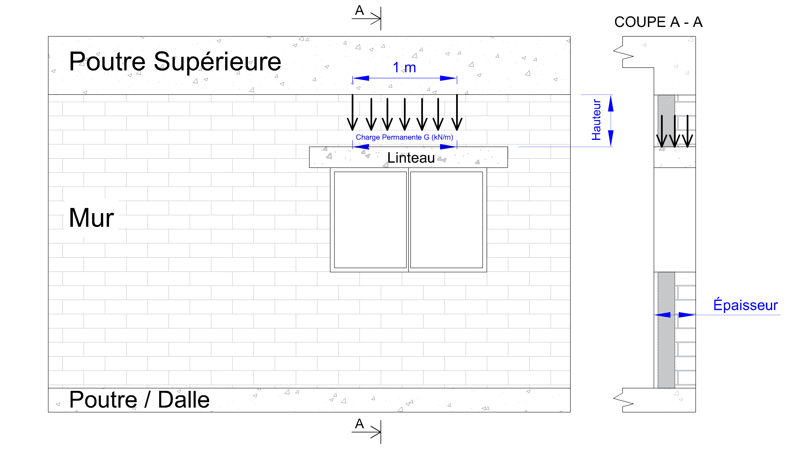
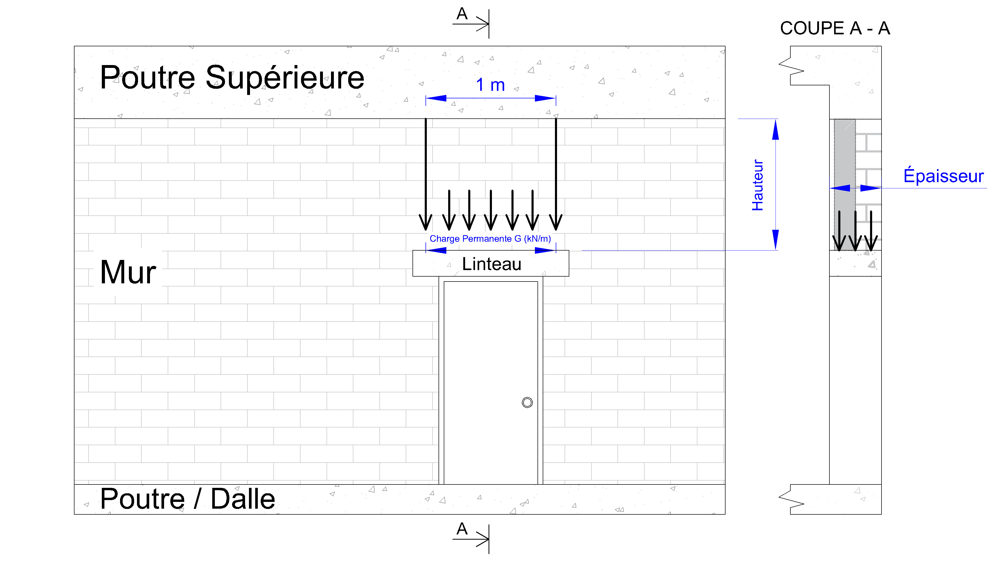

# 🧱 Wall Load-Bearing Calculation Tool

Accurately calculate the vertical load transfer (**descente de charge**) of masonry or reinforced concrete walls in compliance with Eurocode 1.  
This free and open-source tool helps engineers, architects, and builders estimate wall loads quickly and reliably for safe structural design.

---

## 🚀 Features

- ✅ Based on Eurocode 1 principles  
- 🎯 Automatic calculation of wall self-weight (G) and total load per meter (kN/m)  
- 🖥️ Simple and intuitive web interface  
- 📊 Directly usable for beam reinforcement and lintel design  
- 🔓 Free and unlimited access  

---

## 📘 How to Use

### For new structures:
1. **Select materials** → Choose wall materials from the provided list.  
2. **Enter dimensions** → Wall thickness and height (cm or m).  
3. **Get results** → The tool provides self-weight (G) and total load per linear meter (kN/m), ready for use in structural calculations (e.g., beam reinforcement, lintel design).

### For existing walls:
1. **Measure layers** → Record the thickness of each wall layer.  
2. **Select materials** → Choose the corresponding materials from the list.  
3. **Add total height** → Enter the overall wall height.  

👉 If the wall material is unknown, select **reinforced concrete** (highest density).  
This conservative assumption, consistent with Eurocode, avoids underestimation and ensures structural safety.  

The calculation is based on multiplying the material’s surface load by the wall’s thickness and height, while applying **Eurocode 1 load factors**.

Depending on the arrangement of supports and the stiffness of the elements, a portion of the variable loads may be transferred to the wall. This should be checked on a case‑by‑case basis according to the load path principles defined in Eurocode 1. Check the images to be sure.

## Safe for calculation


## In this case, contact the design bureau



---

## 📐 Special Cases

- **Window or door lintels (reinforced concrete):**  
  - Measure the wall height between the lintel and the upper beam.  
  - Enter the material and dimensions.  
  - If you are also using our [Lintel Reinforcement Calculator](https://beton-guide.com/calcul/descente-charges-murs.html), you do **not** need to add the lintel’s own weight—it is already included.
 
 


- **Variable loads (Q):**  
  Unlike slabs, walls do not directly carry variable loads.  
  Loads from slabs or roofs are transmitted through beams.  
  In most cases, the wall’s load transfer is due only to its **self-weight (G)**, unless structural configuration requires a fraction of **Q** to be applied (to be checked case by case under Eurocode 1).

---

## 📦 Installation & Usage

This is a **web-based tool**. No installation required.  

👉 Use it online: [Wall Load Calculator – beton-guide.com](https://beton-guide.com/calcul/descente-charges-murs.html)

🔗 Standards & References

Eurocode 1: EN 1991-1-1 (Actions on Structures – Densities, Self-weight, Imposed Loads)

Eurocode 2 (EN 1992-1-1) for reinforced concrete design related to beams and lintels

📄 License

This project is open source under the MIT License.

👤 Author & Maintainer

Dimitry Lyubichev
Civil Engineer (Building Engineering Institute, Kiev – MSc equivalent)
Experience: construction worker, design office technician, RC draftsman, concrete technologist.
Creator of [beton-guide.com](https://beton-guide.com)

To run locally or contribute:

```bash
# Clone repository
git clone https://github.com/your-username/wall-load-calculator.git
cd wall-load-calculator

# Open index.html in your browser
